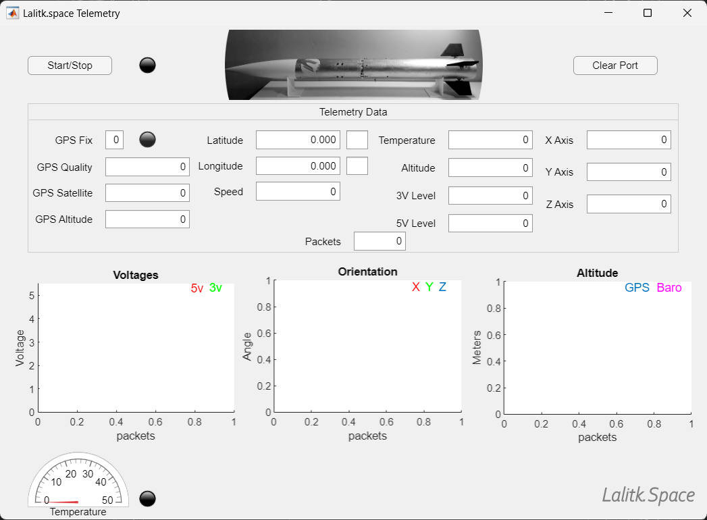

# Ground_Station
 Ground Station (GUI) to receive and visualize live telemetry.

* The project is developed to visualize live telemetry from a Flight Computer that I have developed.
* Two telemetry GUIs are developed, one in MATLAB using the App Designer tool and another one using Python (Tkinter) GUI toolkit.
* An example code is provided for Arduino to behave as a flight data receiver that transmits the received telemetry serially to the Ground Station GUI.  
The primary purpose of the example code is to understand the telemetry format that must be transmitted to the GUI. The GUI will decode the received data and display it. </b>

## Demonstration 
  [Ground Station (GUI) Telemetry Demonstration](https://www.youtube.com/watch?v=vqx3Z946B_U) 

# GUI Screenshot [MATLAB]

# GUI Screenshot [Python]

# Description
General description of the telemetry GUI

### `GUI is capable of visualizing`
  1. `GPS data` 
      - Whether GPS is fixed or not
      - GPS quality
      - Satellites connected
      - GPS altitude
      - Longitude
      - Latitude
      - GPS speed
  2. `Environmental Data`
      - Temperature
      - Altitude
      - Pressure (disabled)
  3. `Voltage level`
      - 3.3V systems level
      - 5V systems level
  4. `Orientation data`
        - Acceleration in the X, Y, and X axis
  5. `Plots` 
      - Voltages graph 
      - Orientation graph (Acceleration)
      - Altitude graph (both GPS and Barometric)
      - Guage for temperature
      - with high-temperature warning